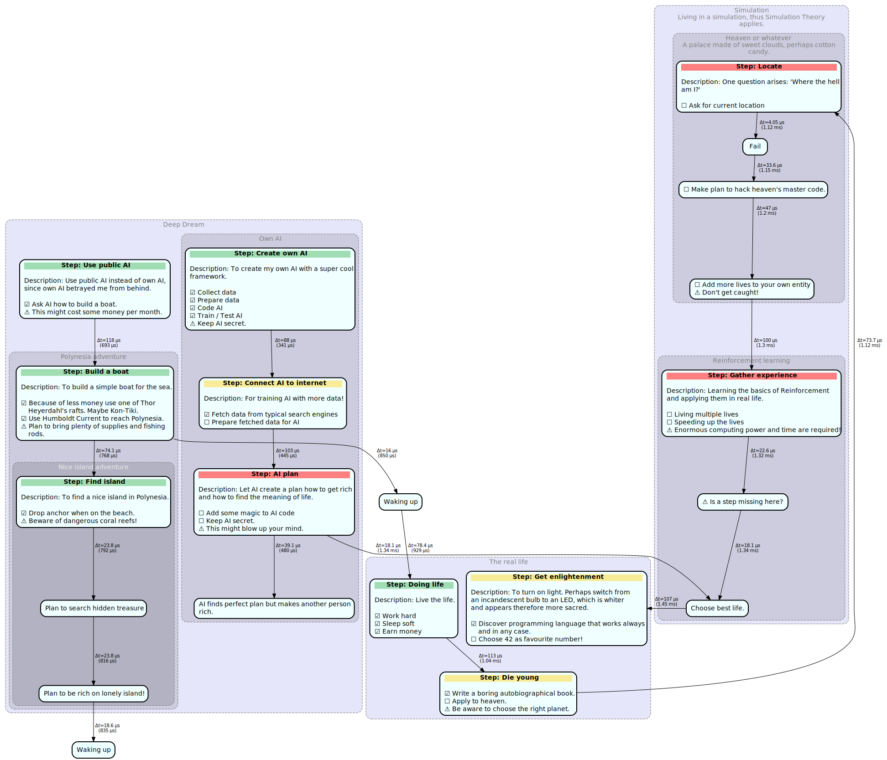

# EasyGraph

[](LICENSE)
[](#requirements)

**EasyGraph** turns plain Python into beautiful, self‑documenting Graphviz diagrams.

---

## Main Idea

EasyGraph lets you turn the "to-do" notes you already write in code into clear, directed graphs.
Just embed a structured, triple-quoted comment beside each task — or even use only the keywords you need for a quick, lightweight note — and EasyGraph converts it into a visual workflow that scales from tiny helpers to large, multi-module projects. The result is an at-a-glance project map that is ideal for tracking progress. EasyGraph might also help present the project to others and give a clear visual overview.

---

## Features

- **Rich node markup** – `Step:`, `Description:`, `[ ]`, `[X]`, `Note:` rendered automatically  
- **Auto‑chaining** – new nodes link to the previous one unless you specify a source (manually is also possible)
- **Colour‑graded clusters** – up to 10 nested levels (by default)
- **Timing labels** – `Graph(measure_time=True)` stamps edges with run‑time deltas  
- **Cross‑module graphs** – register one graph globally and extend it from any file  

---

## Installation

> ⚠️ **Note:** Git is required for installation. If you don’t already have it, follow the instructions at [Git Guides – Install Git](https://github.com/git-guides/install-git).


```bash
pip install git+https://github.com/BoraBoraPalm/easygraph.git
```

For development:

```bash
git clone https://github.com/BoraBoraPalm/easygraph.git
cd easygraph
pip install -e .
```

---

## Quick Start

### Basic graph

```python
from easygraph import Graph

# Initially, a Grapg object is required
g = Graph()

# (1) #
text = """Step: First Step ===================================================  

Description: This is the description of the first step.

    [ ] An item to complete. Use brackets and a white space.
    [X] An completed item. Lower x or capital X can be used.
    Note: Use 'Note' If there is something special to consider.
"""
g.add_node("The first step", text=text, title_colour="yellow")
###############################################
#   Place for code that is described by the   #
#   text and visualised by the node above     # 
###############################################


# (2) #
text = """Step: Second Step ==================================================  
    
Description: We only use the 'Description' and 'Note' keyword here. Simple 
text without a keyword is also possible.
    
    Note: Additionally, using 60% of normal width of node.
"""
g.add_node("The second step", text=text, width=0.6)
###############################################
#   Place for code that is described by the   #
#   text and visualised by the node above     # 
###############################################


# (3) #
g.add_node("The third step ===================================================", 
           text="This step can be anywhere! No concrete idea yet, or just "
                "small step.",
           width=0.4)


# Finally, create and save it
g.create()                      # to create the graph from the collected infos
g.save("examples/basic_test")   # to save it by default as svg 
```


---

### Deep nesting

```python
from easygraph import Graph

# To create the graph object
g = Graph()

# For nesting the clusters simply define the supercluster
g.add_cluster("Cluster 1", text="Up to 10 nested levels.")

for level in range(2, 11):
    g.add_cluster(f"Cluster {level}", supercluster=f"Cluster {level-1}")

# When defining the nodes they can be assigned to clusters
g.add_node("1st Node", cluster="Cluster 10")
g.add_node("2nd Node", cluster="Cluster 1")
g.add_node("3rd Node") # no cluster
g.add_node("4th Node", cluster="Cluster 6")

# Create and save the graph
g.create()
g.save("examples/nesting_test")
```


---

### One graph across multiple modules

`example_2a_global.py`

```python
from easygraph import Graph
from example_2b_global import some_function_2b
from example_2c_global import some_function_2c
import time

# Creating an instance of the class and make it global
g = Graph(measure_time=True)   # graph object
g.add_global("global test")    # make it global with a unique name


# Add clusters in current file and access the graph object locally
g.add_cluster("Overview", text="Nodes are spread across files.")
g.add_cluster("2a module", supercluster="Overview")
g.add_node("Node 1", cluster="2a module")

# Call functions of other modules that also using this graph (via unique name)
time.sleep(1.5); some_function_2b()
time.sleep(0.3); some_function_2c()

# Final node, again in this module
g.add_node("Completed", cluster="2a module")


# Again, create and save the graph
g.create()
g.save("examples/global_test")
```

`example_2b_global.py`

```python
from easygraph import Graph

def some_function_2b():
    # Global access of the graph object created above in the other module
    Graph.globals["global test"].add_cluster("2b module", supercluster="Overview")
    Graph.globals["global test"].add_node("Node 2", cluster="2b module")
```

`example_2c_global.py`

```python
from easygraph import Graph

def some_function_2c():
    # Again global access. The same methods can be used, the object just must be 
    # be called differently (directly via Graph[identifier string]).
    Graph.globals["global test"].add_cluster("2c module", supercluster="Overview")
    Graph.globals["global test"].add_node("Node 3", cluster="2c module")
```


---
### A bigger example graph
You can find the code in the examples folder in the file `example_1_big.py`.


