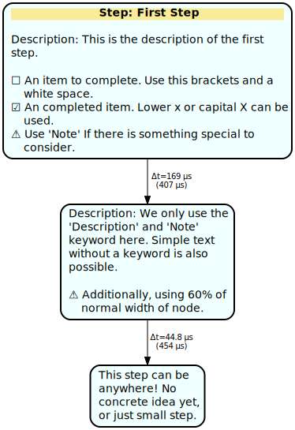
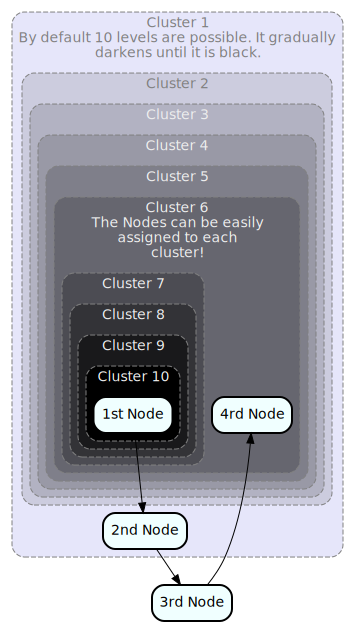
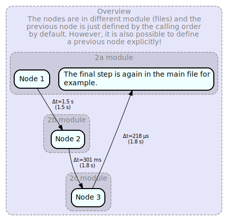

# EasyGraph

[](LICENSE)
[](#requirements)

**EasyGraph** turns plain Python into beautiful, self‑documenting Graphviz diagrams.  
Model workflows with nodes, check‑boxes, notes, timing overlays, and multi‑level clusters—then export a crisp SVG in one call.

---

## Features

- **Rich node markup** – `Step:`, `Description:`, `[ ]`, `[X]`, `Note:` rendered automatically  
- **Auto‑chaining** – new nodes link to the previous one unless you specify a source  
- **Colour‑graded clusters** – up to 10 nested levels  
- **Timing labels** – `Graph(measure_time=True)` stamps edges with run‑time deltas  
- **Cross‑module graphs** – register one graph globally and extend it from any file  

---

## Installation

```bash
pip install git+https://github.com/yourusername/easygraph.git
```

For development:

```bash
git clone https://github.com/yourusername/easygraph.git
cd easygraph
pip install -e .
```

### Requirements

| Requirement | Notes |
|-------------|-------|
| Python 3.6 – 3.11 | |
| `graphviz` ≥ 0.20 (Python binding) | Installed automatically |
| Graphviz system package | `sudo apt install graphviz` on Ubuntu or the Windows installer from **graphviz.org** |

---

## Quick Start

### Basic graph

```python
from easygraph import Graph
from types import SimpleNamespace

g = Graph()
text = """Step: First Step
Description: This is the description of the first step.
[ ] An item to complete
[X] A completed item
Note: Something special to consider.
"""

g.add_node("The first step", text=text, title_colour="yellow")

g.add_node(
    "The second step",
    text="Description: only a few keywords used\nNote: Node width 60 %",
    width=0.6
)

g.add_node(
    "The third step",
    text="This step can live anywhere—maybe another module.",
    width=0.4
)

g.create()
g.save("examples/basic_test")
```



---

### Deep nesting

```python
from easygraph import Graph

g = Graph()
g.add_cluster("Cluster 1",
              text="Up to 10 nested levels, gradually darkening.")
for level in range(2, 11):
    g.add_cluster(f"Cluster {level}",
                  supercluster=f"Cluster {level-1}")

g.add_node("1st Node", cluster="Cluster 10")
g.add_node("2nd Node", cluster="Cluster 1")
g.add_node("3rd Node")               # no cluster
g.add_node("4th Node", cluster="Cluster 6")

g.create()
g.save("examples/nesting_test")
```



---

### One graph across multiple modules

`example_2a_global.py`

```python
from easygraph import Graph
from example_2b_global import some_function_2b
from example_2c_global import some_function_2c
import time

g = Graph(measure_time=True)
g.add_global("global test")

g.add_cluster("Overview",
              text="Nodes are spread across files; "
                   "previous node is auto-detected unless overridden.")
g.add_cluster("2a module", supercluster="Overview")
g.add_node("Node 1", cluster="2a module")

time.sleep(1.5); some_function_2b()
time.sleep(0.3); some_function_2c()

g.add_node("Completed",
           text="Final node back in the main file.",
           cluster="2a module")

g.create()
g.save("examples/global_test")
```

`example_2b_global.py`

```python
from easygraph import Graph

def some_function_2b():
    Graph.globals["global test"].add_cluster("2b module",
                                             supercluster="Overview")
    Graph.globals["global test"].add_node("Node 2", cluster="2b module")
```

`example_2c_global.py`

```python
from easygraph import Graph

def some_function_2c():
    Graph.globals["global test"].add_cluster("2c module",
                                             supercluster="Overview")
    Graph.globals["global test"].add_node("Node 3", cluster="2c module")
```



---

## Contributing

Bug reports, feature requests, and pull requests are welcome.  
For substantial changes, please open an issue first to discuss what you would like to change.

---

## License

Released under the MIT License – see [`LICENSE`](LICENSE) for full text.
